# Bright Cluster Manager Tutorial with VMware

NVIDIA Bright Cluster Manager instructions for installing on a VM and using NVIDIA GPUs.

Much of the information provided relies on NVIDIA Bright Cluster Manager [documentation](https://docs.nvidia.com/bright-cluster-manager/index.html).

## Introduction

[NVIDIA Bright Cluster Manager](https://www.nvidia.com/en-us/data-center/bright-cluster-manager/) offers fast deployment and end-to-end management for heterogeneous high-performance computing (HPC) and AI server clusters at the edge, in the data center, and in multi/hybrid-cloud environments. It automates provisioning and administration for clusters ranging in size from a couple of nodes to hundreds of thousands, supports CPU-based and NVIDIA GPU-accelerated systems, and enables orchestration with Kubernetes.

This repository will include the instructions for installing and running Bright Cluster Manager on [VMware vSphere](https://www.vmware.com/il/products/vsphere.html) VMs and using vGPUs.

## Requirements

- Bright Cluster Manager license.
- vGPU license.

## Head node installation

1. Download Bright's ISO file from [Bright's download page](https://customer.brightcomputing.com/Download).
    - Architecture: `x86_64/amd64`.
    - Linux Base Distribution: `Ubuntu 20.04`.
    - Hardware Vendor: `Generic / Other`.
    - Additional Features: mark `Include CUDA Packages`.
        - __Note:__ mark `Include OFED and OPA Packages` and `Include NVIDIA DGX A100 software image` if needed. This will create an additional software image for the DGX.
1. Upload the ISO file to vSphere's datastore.
1. Create a new VM with the following settings:
    - Name (optional): `bright_head_node`.
    - Guest OS: `Linux - Ubuntu (64-bit)`.
    - Virtual Hardware:
        - CPU: >= `4 CPUs`.
        - Memory: >= `16 GB`.
        - Hard disk: >= `128 GB`.
            - __Note:__  external storage might be used.
        - Create two network adapters:
            - An external network.
            - An internal network.
        - CD/DVD drive: Datastore ISO File.
            - Select Bright's ISO file.
            - Mark the `"Connected"` and `"Connect At Power On"` checkboxes.
    - VM Options:
        - Boot Options: Firmware - `EFI`.
1. Launch the VM and connect to it (recommended through the remote console).
1. Follow Bright's Graphical installer and note the following:
    - Workload manager: `None`.
        - __Note:__ A workload manager will be installed later. This is due to the fact that Pyxis and Enroot will NOT be installed if Slurm is chosen in this stage.
    - Network topology: `Type1`.
    - Head node:
        - Hardware manufacturer: `Other`.
    - Networks:
        - externalnet:
            - Keep `DHCP` marked.
        - internalnet.
        - __Note:__ make sure the correct networks are set.
    - Head node interfaces:
        - External network:
            - Network: `externalnet`.
            - IP address: `DHCP`.
        - Internal network:
            - Network: `internalnet`.
        - __Note:__ make sure the correct networks are set.
    - Compute nodes interfaces:
        - Interface: `BOOTIF`.
        - Network: `internalnet`.
    - Additional software: mark the `CUDA` checkbox.
        - __Note:__ mark the `OFED` checkbox if needed.
    - Complete the installation.
1. After installation was completed:
    - Choose to reboot the VM.
    - In the VM settings, unmark the `Connected` checkbox from the head node VM CD/DVD drive.
    - Restart the VM.

## Head node post-installation

1. Launch and SSH to the head node with the `root` username and the password chosen during installation.
1. Confirm the node is visible to the internet with `ping www.google.com`.
1. Update the node with `apt -y update`, `apt -y upgrade` and `apt -y autoremove`.
1. Install Bright's license by running: `request-license`.
    - __Note:__ valid details are optional.
    - __Note:__ in case the cluster is in a dark-site and air-gapped environment:
        - Run `request-license` to generate a CSR (certificate request).
        - Move the certificate to the licensing server of Bright to get a signed license.
        - Copy the license back to the cluster and install it using `install-license`.
1. __Optional:__ change the home directory to an external drive with either:
    - Editing the `fsmounts` by running:

        ```bash
        cmsh
        category use <category-name>
        fsmounts
        use /home
        set device <hostname/IP of the NAS>:</path/to/export>
        commit

        ```

    - Running `cmha-setup`.
        - __Note:__ this option is only meant for HA for Bright and this includes moving the /cm/shared and /home to an external shared storage (NAS or DAS or DRBD).
1. Fix compute nodes DNS by running:

    ```bash
    cmsh
    category use <category-name>
    append nameservers <nameserver>
    commit
    quit

    ```

    - __Note:__ the nameservers is empty, therefore any existing nameservers should also be added.
    - __Note:__ order of nameservers is important.
1. The following changes should be made for each software image:
    1. View all images:

        ```bash
        cmsh
        softwareimage
        list

        ```

    1. Clone the relevant image to a new image:

        ```bash
        softwareimage
        clone <from-image> <image-name>
        commit

        ```

        - __Note:__ wait for `Initial ramdisk for image <image-name> was generated successfully` message to appear.

    1. Clone the default category to a new category and assign the relevant image:

        ```bash
        category
        clone default <category-name>
        set softwareimage <image-name>
        commit

        ```

    1. Assign the relevant nodes to the relevant category:

        ```bash
        device
        set <node-name> category <category-name>
        commit
        quit

        ```

    1. Update the software image by running:

        ```bash
        cm-chroot-sw-img /cm/images/<image-name>
        apt -y update
        apt -y upgrade
        apt -y autoremove
        exit

        ```

    1. Update the kernel if a newer version is available by running:

        ```bash
        cmsh
        softwareimage
        use <image-name>
        show | grep "Kernel version"
        kernelversions

        ```

        - Compare the versions, if a newer version is available and not set for the software image, set it by running:

        ```bash
        set kernelversion <kernel-version>
        commit

        ```

        - __Note:__ wait for `Initial ramdisk for image <image-name> was generated successfully` message to appear, then run `quit`.

1. Install a workload manager by running: `cm-wlm-setup` and note the following for Slurm:
    - TODO: convert the following into a one liner.
    - Choose `Setup (Step By Step)`.
    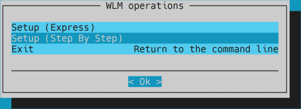
    - Choose `Slurm`.
    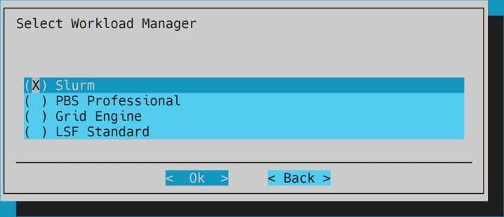
    - Optional: keep cluster name `slurm`.
    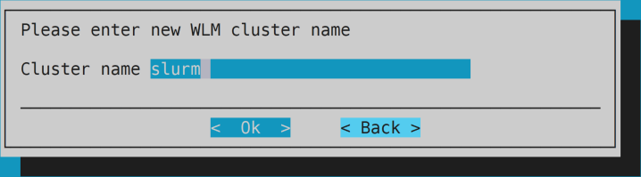
    - Keep the head node only for server role.
    
    - Optional: keep overlay configuration.
    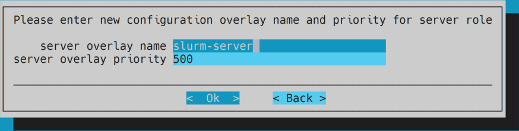
    - Optional: unselect everything for client role.
    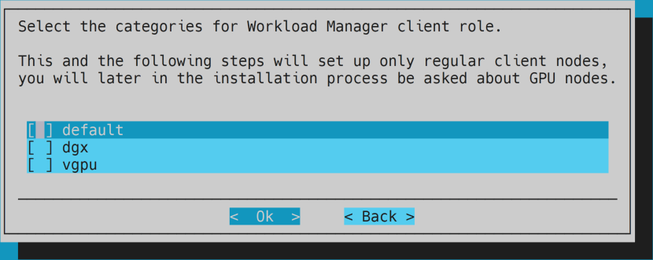
    - Optional: unselect everything for client role.
    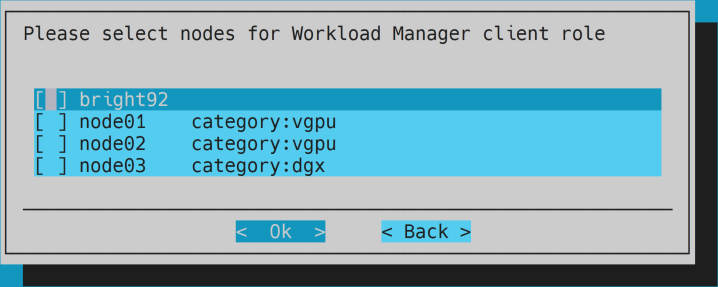
    - Optional: keep overlay configuration.
    
    - Optional: keep prejob healthchecks empty.
    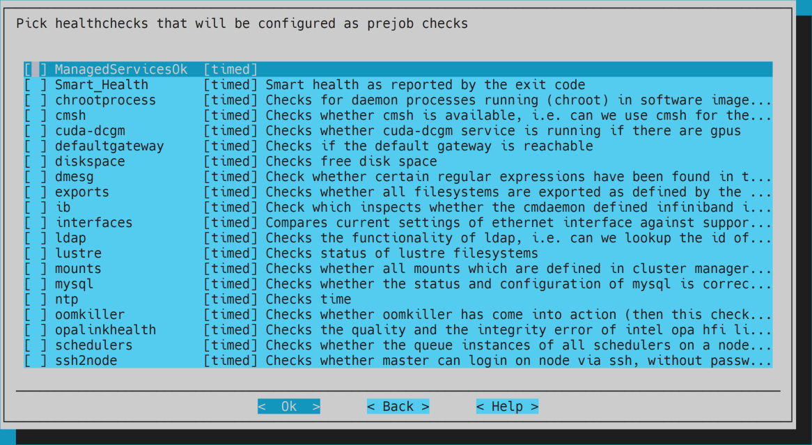
    - Select `yes` for GPU resources settings.
    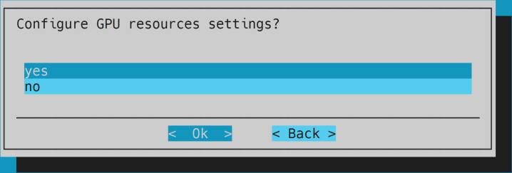
    - Optional: keep settings for configuration overlay.
    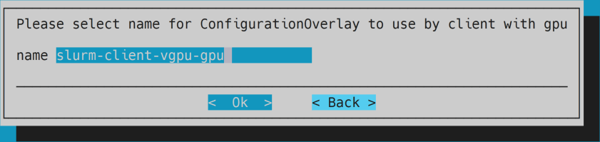
    - Select all categories that include a GPU for GPU role.
    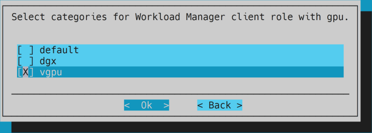
        - TODO: update the image.
    - Keep the head node unselected for GPU role.
    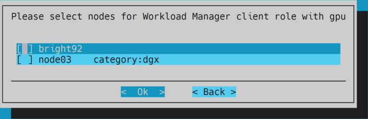
    - Optional: keep settings for configuration overlay.
    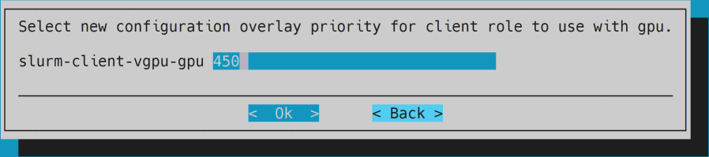
    - Optional: keep slots amount empty.
    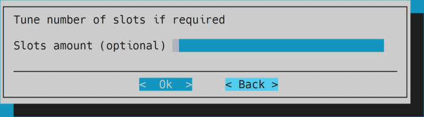
    - Keep selected for submit role.
    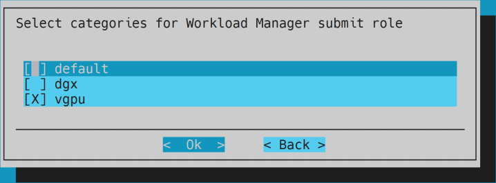
    - Keep the head node for submit role.
    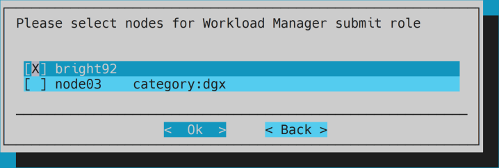
    - Optional: keep default settings for overlay.
    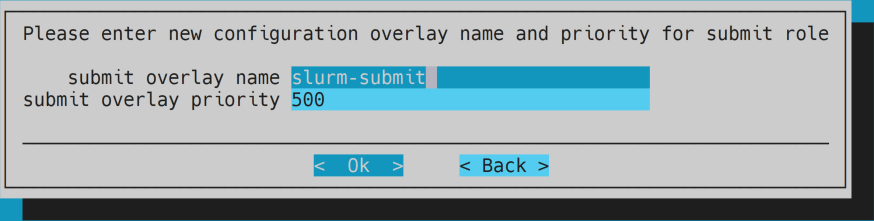
    - Optional: keep accounting configuration.
    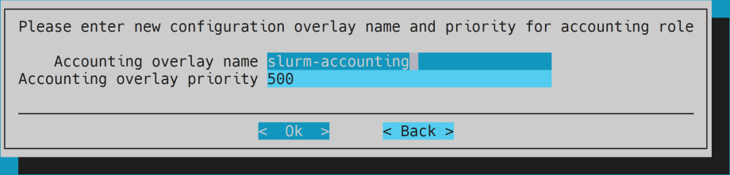
    - Optional: keep the head node for storage host.
    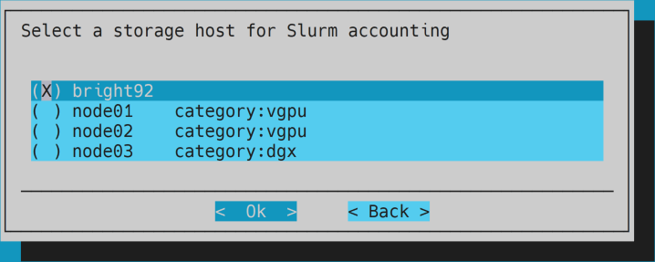
    - Optional: select `no` for Slurm power saving.
    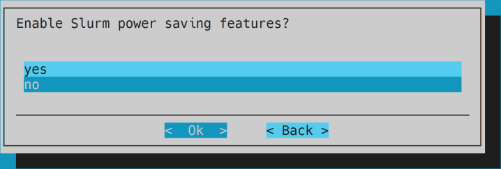
    - Select `Automatic NVIDIA GPU configuration`.
    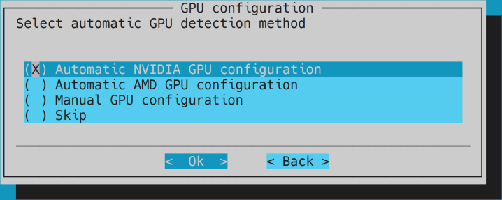
    - Modify the `Count` column with the number of GPUs per compute node. No need to enter any other details.
    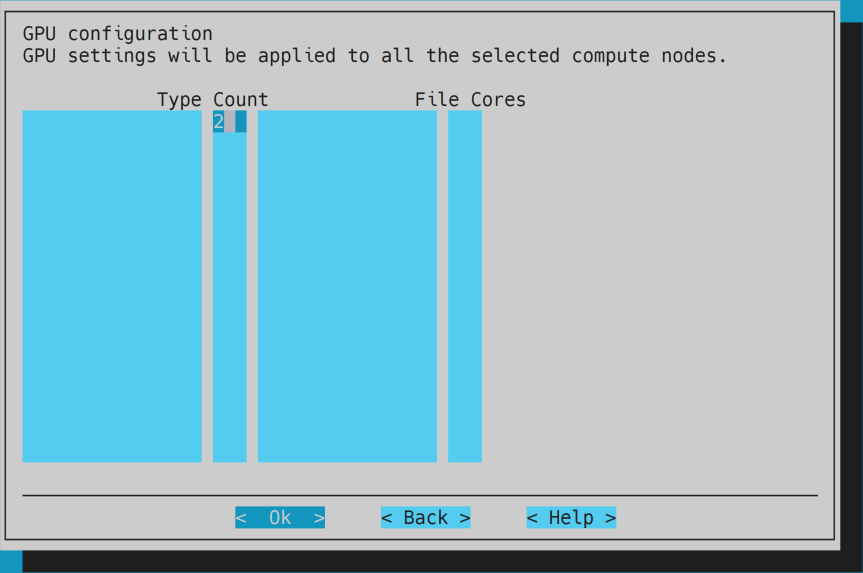
        - __Note:__ in case there are different number of GPUs in different compute nodes:
        - Set the number of GPUs for one version of a compute node (e.g., a compute node with 2 GPUs).
        - After the installation is complete duplicate the configuration and modify it for any other version (explained in the next bullet).
    - Select `yes` for configuring Pyxis plugin.
    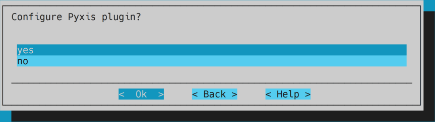
    - Optional: keep Cgroups constraints empty.
    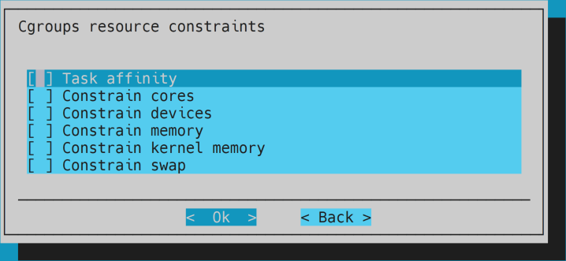
    - Optional: keep default queue name.
    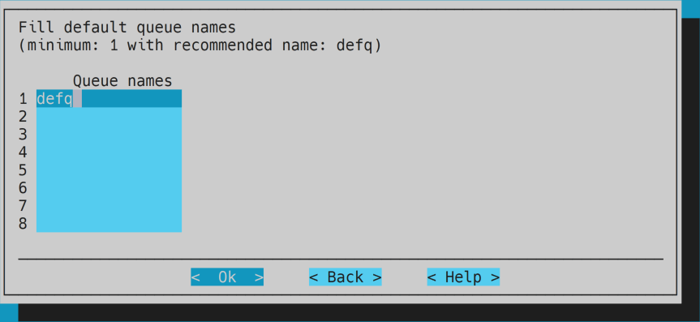
    - Select `Save config & deploy`.
    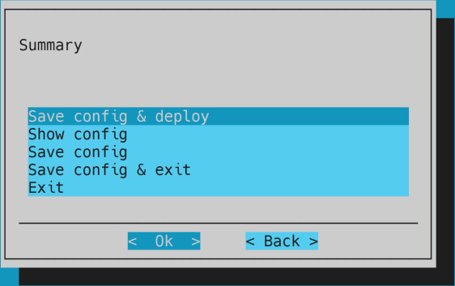
    - Optional: save the configuration file in the default location.
    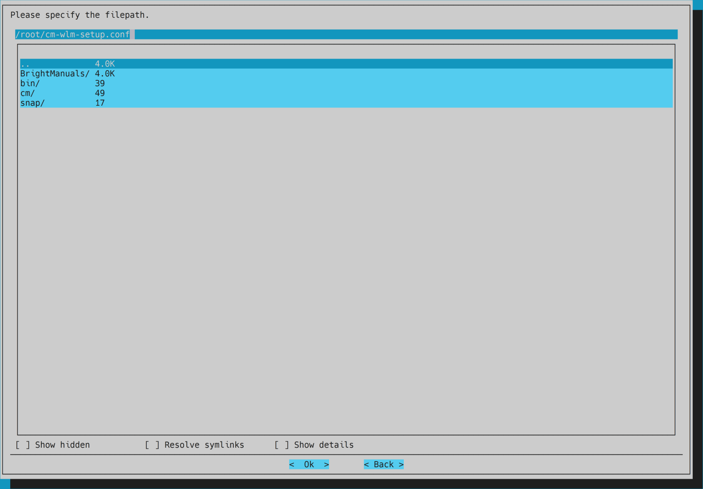
    - Complete the setup.
    - __Note:__ if an error of `Temporary failure resolving 'archive.ubuntu.com'` appears undo the installation by pressing `u`, then try the following solutions for each software image and run again:
        - Relink `resolv.conf`:

            ```bash
            cm-chroot-sw-img /cm/images/<image-name>
            ln -s ../run/systemd/resolve/resolv.conf /etc/resolv.conf
            quit

            ```

        - Manually install Enroot:

            ```bash
            cm-chroot-sw-img /cm/images/<image-name>
            wget https://github.com/NVIDIA/enroot/releases/download/v3.4.0/enroot_3.4.0-1_amd64.deb
            apt -y install ./enroot_3.4.0-1_amd64.deb
            apt -y remove enroot\*
            rm ./enroot_3.4.0-1_amd64.deb
            exit

            ```

            - __Note:__ use the [latest](https://github.com/NVIDIA/enroot/releases/latest) Enroot's release.

        - __Note:__ if Slurm still exist, remove it before reinstalling by running the `cm-wlm-setup` script and choosing `Disable`.

        - __Note:__ if previous configuration overlays still exist, remove them before reinstalling:

            ```bash
            cmsh
            configurationoverlay
            list

            ```

            - Remove all listed by running `remove <configuration-overlay>` for each one, then exit with `quit`.

1. In case there are different number of GPUs in different compute nodes, clone and set the configuration overlays:
    - First, set the categories of the original configuration overlay so they won't include the different categories:

    ```bash
    cmsh
    configurationoverlay
    use <configuration-overlay>
    set categories <category-name>
    commit

    ```

    - Then, clone the configuration overlay and set the different categories:

    ```bash
    clone <from-configuration-overlay> <configuration-overlay>
    set categories <category-name>
    roles
    use slurmclient
    genericresources
    set gpu0 count <number-of-gpus>
    commit
    quit

    ```

1. Load Slurm by default on the head node by running `module initadd slurm`.
1. __Optional:__ `tmpfs /run` volume is used as a cache for running the containers and configured automatically based on the compute nodes hard disks. To view its size run `df -h` in a compute node. To override the configuration use:

    ```bash
    cmsh
    category use <category-name>
    fsmounts
    clone /dev/shm /run
    set mountoptions "defaults,size=<new size>"
    commit
    quit

    ```

1. There's an issue with `nvidia-uvm` kernel and vGPUs that require some initialize. The issue involves this model being loaded but the path to `/dev/nvidia-uvm` is missing. This can be observed on a compute node by running `env | grep _CUDA_COMPAT_STATUS`. To overcome this issue do the following (provided by Adel Aly):
    - Enter to the software image by running: `cm-chroot-sw-img /cm/images/<image-name>`.
    - Create a new file `/lib/systemd/system/nvidia-uvm-init.service` with the following content:

        ```bash
        # nvidia-uvm-init.service
        # loads nvidia-uvm module and creates /dev/nvidia-uvm device nodes
        [Unit]
        Description=Initialize nvidia-uvm device on vGPU passthrough
        [Service]
        ExecStart=/usr/local/bin/nvidia-uvm-init.sh
        [Install]
        WantedBy=multi-user.target

        ```

    - Create a new file `/usr/local/bin/nvidia-uvm-init.sh` with the following content:

        ```bash
        #!/bin/bash
        ## Script to initialize nvidia device nodes.
        ## https://docs.nvidia.com/cuda/cuda-installation-guide-linux/index.html#runfile-verifications
        /usr/sbin/modprobe nvidia
        if [ "$?" -eq 0 ]; then
        # Count the number of NVIDIA controllers found.
        NVDEVS=`lspci | grep -i NVIDIA`
        N3D=`echo "$NVDEVS" | grep "3D controller" | wc -l`
        NVGA=`echo "$NVDEVS" | grep "VGA compatible controller" | wc -l`
        N=`expr $N3D + $NVGA - 1`
        for i in `seq 0 $N`; do
            mknod -m 666 /dev/nvidia$i c 195 $i
        done
        mknod -m 666 /dev/nvidiactl c 195 255
        else
        exit 1
        fi
        /sbin/modprobe nvidia-uvm
        if [ "$?" -eq 0 ]; then
        # Find out the major device number used by the nvidia-uvm driver
        D=`grep nvidia-uvm /proc/devices | awk '{print $1}'`
        mknod -m 666 /dev/nvidia-uvm c $D 0
        mknod -m 666 /dev/nvidia-uvm-tools c $D 0
        else
        exit 1
        fi
        
        ```

    - Change the permissions of the script file by running: `chmod 777 /usr/local/bin/nvidia-uvm-init.sh`.

    - Enable the service and exit:

        ```bash
        systemctl enable nvidia-uvm-init.service
        exit

        ```

1. __Optional:__ add users.
    - __Note:__ Slurm is not loaded by default for the users. To enable Slurm for all users by default, edit the `/etc/skel/.bashrc` file and add:

        ```bash
        # load Slurm
        module load shared
        module load slurm

        ```

1. Reboot the head node.

## Compute nodes installation

1. Create a new VM with the following settings:
    - Name (optional): `node01`.
    - Guest OS: `Linux - Ubuntu (64-bit)`.
    - Virtual Hardware:
        - CPU: >= `8 CPUs`.
        - Memory: >= `16 GB`.
        - Hard disk: `64 GB` * number of users.
        - Network adapter:
            - An internal network.
        - Create PCI devices per GPU.
    - VM Options:
        - Boot Options: Firmware - `EFI`.
1. Duplicate the VM for any other compute node and change the name accordingly.
1. Launch the first compute node VM and connect to it (recommended through the remote console).
1. The node should be PXE booted by the head node.
    - __Note:__ if an error is present try to reboot the node.
    - Choose the relevant node and provision it with the `FULL` option.
1. SSH to the node from the head node for easier access.
1. Update the node with `apt -y update`, `apt -y upgrade` and `apt -y autoremove`.
1. For vGPU:
    1. Uninstall the existing CUDA driver with `sudo apt -y remove --purge cuda-driver`.
    1. Install the vGPU driver:
        - Download the vGPU driver from [NVIDIA Application Hub](https://nvid.nvidia.com/) -> NVIDIA Licensing Portal -> Software Downloads.
        - Copy the vGPU driver file ending with `.run` to the compute node.
        - Run `cmhod +x <file path>`.
        - Run the installation file.
        - Keep DKMS disabled for the kernel.
        - Accept the warning.
        - Select `No` for installing NVIDIA's 32-bit compatibility libraries.
        - Accept the warning.
        - Run `nvidia-smi` and make sure the GPUs are visible.
        - Remove the installation file.
    1. Install NVIDIA CUDA Container Toolkit ([installation guide](https://docs.nvidia.com/datacenter/cloud-native/container-toolkit/install-guide.html#setting-up-nvidia-container-toolkit)):
        - Setup the package repository and the GPG key by running:

        ```bash
        distribution=$(. /etc/os-release;echo $ID$VERSION_ID) \
        && curl -fsSL https://nvidia.github.io/libnvidia-container/gpgkey | sudo gpg --dearmor -o /usr/share/keyrings/nvidia-container-toolkit-keyring.gpg \
        && curl -s -L https://nvidia.github.io/libnvidia-container/$distribution/libnvidia-container.list | \
                sed 's#deb https://#deb [signed-by=/usr/share/keyrings/nvidia-container-toolkit-keyring.gpg] https://#g' | \
                sudo tee /etc/apt/sources.list.d/nvidia-container-toolkit.list
        
        ```

        - Install the `nvidia-docker2` package (and dependencies) after updating the package listing:

        ```bash
        apt -y update
        apt install -y nvidia-docker2
        
        ```

        - Restart the Docker daemon to complete the installation after setting the default runtime by running: `systemctl restart docker`.
1. Make sure `/home` directory is mounted by running `cat /etc/fstab | grep "master:/home"`.
1. Login to the head node.
1. Grab the node image to your default image by running:

    ```bash
    cmsh
    device
    grabimage -i <image-name> -w <node-name>

    ```

    - __Note:__ the grabbing process might take a few minutes. Wait until a `grabimage [ COMPLETED ]` message appears, then run `quit` to exit.
1. For vGPU, install the vGPU license:
    - [Generate a client configuration token](https://docs.nvidia.com/license-system/latest/nvidia-license-system-quick-start-guide/index.html#generating-client-configuration-token-for-cls-instance).
        - __Note:__ it is important to copy the token file and not only its content. You can use a service such as [Oshi](https://oshi.at/) for easy transfer. Make sure the name of the token didn't change.
    - [Configure a licensed client](https://docs.nvidia.com/license-system/latest/nvidia-license-system-quick-start-guide/index.html#configuring-nls-licensed-client-on-linux).
        - __Note:__ use the software image path: `/cm/images/<image-name>/etc/nvidia/`.
1. Reboot the head node.
1. Reboot all compute nodes one by one, link each new one to its name and allow the default provisioning.
    - __Note:__ make sure the vGPU license is installed by running `nvidia-smi -q | grep -A2 "vGPU Software Licensed Product"` within a compute node.

__Note:__ if a DGX fails to show GPUs when running `nvidia-smi` it might be because the driver wasn't build with a newer kernel. To solve it, reinstall the driver by running `apt reinstall nvidia-driver-<version>` and grab the image via CMSH.

## Running example

This example uses Horovod and TensorFlow.

1. Login to the head node.
1. Pull the latest [NGC TensorFlow container](https://catalog.ngc.nvidia.com/orgs/nvidia/containers/tensorflow) by running: `enroot import 'docker://nvcr.io#nvidia/tensorflow:<TensorFlow version>'`.
    - __Note:__ This will create a local `.sqsh` file.
1. Git clone Horovod's GitHub repository by running: `git clone https://github.com/horovod/horovod`.
1. Submit a Slurm job by running:

    ```bash
    srun --mpi=pmix \
    -G <number of GPUs> \
    --container-image=<path to TensorFlow sqsh file> \
    --container-mounts=<path to Horovod GitHub directory>:/code \
    python /code/examples/tensorflow/tensorflow_synthetic_benchmark.py

    ```

1. Examine the results and observe the GPU usage.

__Note:__ if an error of `Invalid MPI plugin name` is received when running a Slurm job with `--mpi=pmix` it is probably because of a missing package. To solve it:

1. SSH to the relevant node.
1. Run `/cm/shared/apps/cm-pmix3/3.1.4/bin/pmix_info` to view the issue:
1. Install the relevant package by running `apt install libevent-pthreads-2.1-7`.
1. Grab the image.
